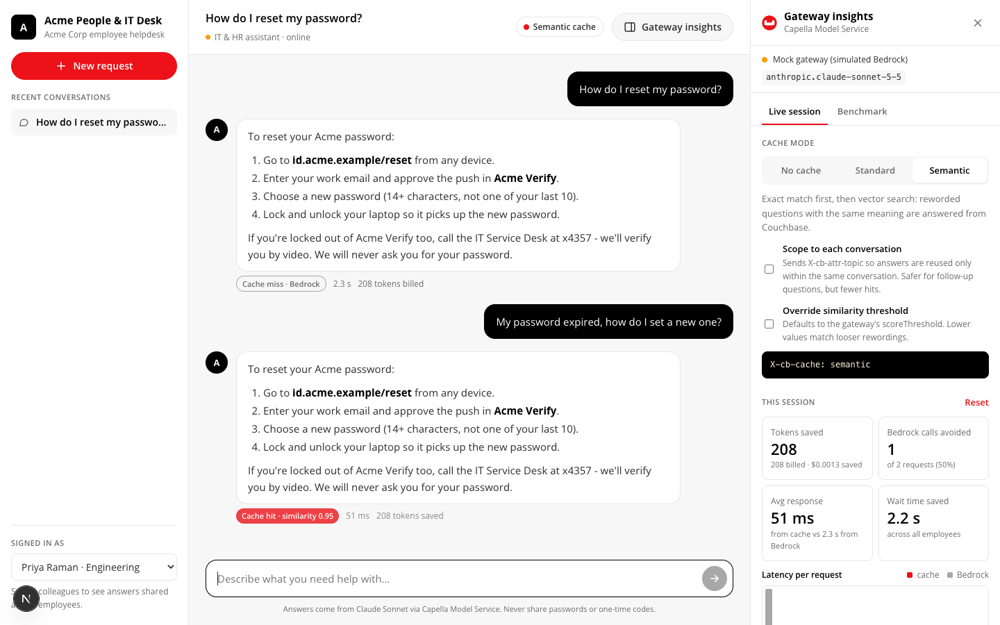
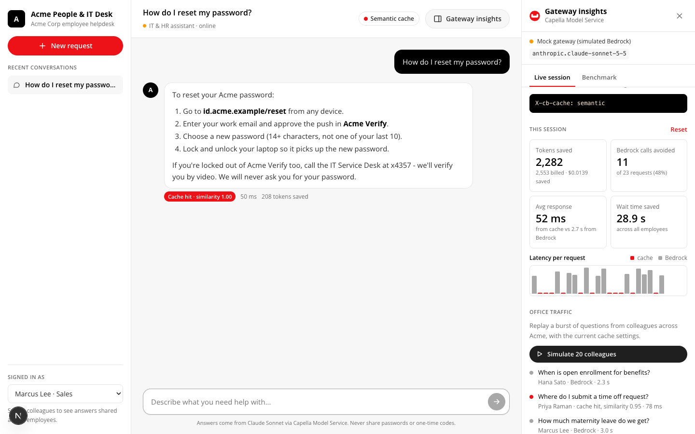
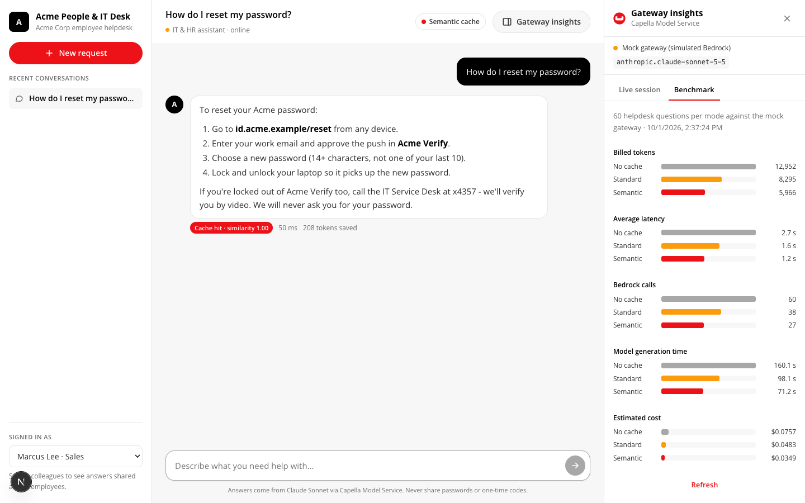

# Capella Model Service cache demo

See how **Standard Cache** and **Semantic Cache** in Couchbase Capella Model Service (the AI Gateway) cut **tokens**, **latency** and **upstream model calls** for an enterprise chat app running on Claude Sonnet via Amazon Bedrock.

The demo is **Acme People & IT Desk**, an internal IT/HR helpdesk. Employees ask the same questions all day: password resets, VPN, time off, benefits, laptops. Some click a suggested question, which sends identical text. Most type their own wording. That is the traffic where caching pays off:

- **Standard Cache** answers identical requests from Couchbase.
- **Semantic Cache** also answers rewordings with the same meaning.
- **One-off questions** still go to the model.



## What it shows

| Benefit | How it is measured |
|---|---|
| **Token saving** | Tokens billed by the model (misses only) vs no-cache baseline; estimated $ from per-token pricing |
| **Less latency** | Avg / p50 / p95 response time; cache hits typically return in tens of ms vs seconds from Bedrock |
| **Resource saving** | Bedrock calls avoided and model generation time not spent |

Two ways to see it:

1. **`apps/web`**: the helpdesk chat app. A **Gateway insights** panel shows, for every answer:
   - whether it came from the cache, with its similarity score
   - its latency and tokens
   - a running total of tokens saved, $ saved, Bedrock calls avoided and wait time saved

   You can switch the cache mode, scope the cache to a conversation, override the similarity threshold, and replay bursts of questions from simulated colleagues across the company.

   Each answer has a **Why? · Trace** link that explains in plain language why it was a hit, a miss or a bypass, and shows the exact request and response (headers and JSON, API key masked) plus **Copy as curl**. The **Traces** tab lists every request in the session, office traffic included.
2. **`apps/bench`**: a repeatable CLI benchmark. It runs the same seeded helpdesk workload through no cache, standard cache and semantic cache, then writes Markdown, HTML and JSON reports.

| Office traffic | Benchmark view |
|---|---|
|  |  |

## Quick start (no Capella access needed)

Needs Node.js 22.9+.

```bash
npm install
cp .env.example .env          # USE_MOCK=true by default

npm run mock                  # terminal 1: mock gateway on :8787
npm run dev                   # terminal 2: helpdesk app on http://localhost:3000
npm run bench                 # terminal 3: benchmark, report in reports/<timestamp>/report.html
```

The **mock gateway** (`packages/mock-gateway`) uses the same API and cache headers as Capella Model Service. It simulates Claude on Bedrock with realistic latency (about 650 ms to first token plus about 18 ms per output token), so the demo runs offline.

## Run against Capella Model Service

**From the UI:** open **Gateway insights** and click the connection row (endpoint and model) to open **Connection settings**:

- **Server default** uses `.env`.
- **Mock gateway** uses the local mock.
- **Capella Model Service** takes an endpoint URL, API key and model. **Test connection** lists the models the endpoint serves, including any embedding model.

The panel and **Test connection** also read `GET /v1/info`: gateway version, commit and build date, each model's kind and health, and the default cache TTL. `npm run bench` records the same info in `results.json` and in the report header, so each set of numbers says which gateway build produced it.

The **Model** picker at the top of the panel lists every model the endpoint serves, grouped as chat and embedding. With a chat model, messages go to `/v1/chat/completions` through the cache. With an embedding model (for example `amazon.titan-embed-text-v2:0`), each message goes to `POST /v1/embeddings` instead. The reply shows the vector's dimensions, its first values and its cosine similarity to earlier questions in the conversation: the same kind of comparison the semantic cache makes. The gateway does not cache embeddings, so these calls send no `X-cb-cache` header and are left out of the cache savings figures. Use the expand button in the panel header to open **Gateway insights** full screen; press Esc to return.

These preferences are saved in your browser. The API key is kept only for the current tab unless you tick **Remember the API key on this device**. Either way it goes only to this app's own server, which forwards it to the gateway, and it is masked in traces. On a shared deployment, set `DISABLE_UI_CONNECTION=true` so the server never calls a URL supplied by a browser.

**From `.env`** (also used by the CLI benchmark):

```bash
USE_MOCK=false
CMS_ENDPOINT=https://<your-model-service-endpoint>
CMS_API_KEY=<api key with cache access>
CMS_MODEL=<Claude Sonnet model name as listed by GET /v1/models>
```

Then run `npm run dev` and `npm run bench`. Requirements on the Capella side:

- The model has **caching enabled**, with both standard and semantic cache types.
- Semantic cache has an **embedding model connected**, with matching vector dimensions.
- The API key has the cache role.

`.env` is git-ignored. The API key is only read server-side (Next.js API routes and the CLI) and never reaches the browser.

To make the $ estimate match your bill, set `PRICE_INPUT_PER_MTOK` and `PRICE_OUTPUT_PER_MTOK` (USD per million tokens). The defaults are Anthropic's list prices for Claude Sonnet 5.5 ($2 / $10). Claude on Bedrock is billed by AWS at [its own rates](https://aws.amazon.com/bedrock/pricing/).

## How the cache is controlled

Each request is an OpenAI-compatible `POST /v1/chat/completions` with `Authorization: Bearer <key>`. The cache is driven by request headers (names verified against the AI Gateway source):

| Header | Purpose |
|---|---|
| `X-cb-cache: none \| standard \| semantic` | Cache type for this request (overrides the model's `defaultCacheType`) |
| `X-cb-attr-topic: <id>` | Scopes the cache to one conversation; any `X-cb-attr-*` attribute partitions the cache |
| `X-cb-cache-threshold: 0.75` | Overrides the semantic similarity threshold (`scoreThreshold`) |
| `X-cb-cache-expiry-duration: 3600` | Cache entry TTL in seconds |
| `X-cb-debug: true` | Returns debug headers, including `X-cb-match-score` on hits |

Response: `X-Cache: HIT` on a cache hit. On a miss the header is normally absent. With `X-cb-debug: true` the gateway also returns `x-cb-cache-enabled`, `x-cb-cache-type`, `x-cb-cache-expiry`, `x-cb-semantic-cache-match-threshold` and `x-cb-semantic-cache-embedding-model`. The trace explanation uses these. For example, `x-cb-cache-enabled: false` means caching is off for that model or API key. A first-turn question that misses again after an earlier identical request is flagged **repeat missed**: the gateway did not store the earlier answer, so check its logs for cache write errors. A hit returns the stored response unchanged, including its original `usage`, which is exactly the number of tokens the model did not have to process again.

**Standard cache** keys on a SHA-256 of the whole request: messages, model, parameters, system prompt, `X-cb-attr-*` attributes and the calling API key.

**Semantic cache** works in two steps:
1. It tries that exact key first.
2. If that misses, it embeds the **last user message** and runs a vector search over cached entries that share the same model, parameters, system prompt, attributes and caller.

Two consequences shape the demo:

- **The system prompt is part of the key.** The app fixes it server-side. The benchmark adds a per-run tag to the system prompt so every run starts with a cold cache.
- **Semantic matching looks only at the last user message.** A follow-up like "what about contractors?" can match an answer given in another context. Turn on **Scope to each conversation** (`X-cb-attr-topic`) when follow-ups depend on context. You trade some hit rate for correctness.

## Sample benchmark (mock gateway, 60 questions per mode)

| | Tokens saved | Bedrock calls avoided | Avg latency | Model time saved |
|---|---|---|---|---|
| Standard cache | 36.0% | 36.7% | -38.4% | 62 s |
| Semantic cache | 53.9% | 55.0% | -54.5% | 89 s |

| Mode | Exact repeats | Paraphrases | One-off questions |
|---|---|---|---|
| Standard cache | 65% hit | 21% hit | 0% |
| Semantic cache | 77% hit | 54% hit | 0% |

These numbers come from the mock gateway. Run `npm run bench` against your Capella endpoint for real figures; actual hit rates depend on your embedding model and `scoreThreshold`.

Benchmark options: `npm run bench -- --help`. The main ones:
- `-n` sets the number of questions.
- `--seed` changes the workload.
- `--threshold` overrides the similarity threshold.
- `-c` sets concurrency. Above 1, identical in-flight requests can both miss.

## Repository layout

```
packages/core          gateway client (headers, hit/miss, usage, latency), pricing, stats, helpdesk dataset + workload
packages/mock-gateway  offline stand-in for Capella Model Service (standard + semantic cache, simulated Bedrock)
apps/bench             CLI benchmark and report generator
apps/web               Next.js helpdesk chat app with the Gateway insights panel
tests/                 vitest: cache semantics, gateway over HTTP, stats
```

```bash
npm test            # unit + integration tests (mock gateway over HTTP)
npm run typecheck
npm run build       # production build of the web app
```

### About the mock's semantic matching

The mock's semantic matching differs from the real gateway in one way.

- **The real gateway** compares the question's embedding with the embeddings of cached responses, using the connected embedding model.
- **The mock** has no embedding model offline. It compares the question with cached questions, using a small concept-vector embedding built from helpdesk vocabulary.

It reproduces the behaviour, with paraphrases matching and different intents not matching. Its scores are illustrative only.

## License

Apache-2.0. See [LICENSE](LICENSE). Acme Corp is fictional.
